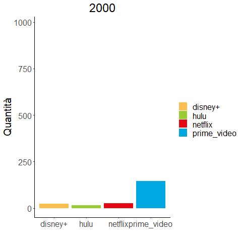
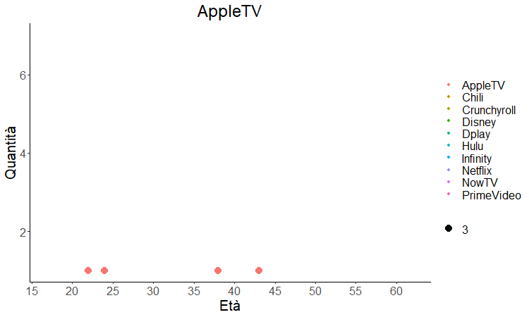

```{r setup, include=FALSE}
knitr::opts_chunk$set(cache = FALSE, message = FALSE, warning = FALSE)
```

# Introduzione
```{r, results='hide', echo=FALSE, message=FALSE, warning=FALSE}
#caricamento librerie
library(ggplot2)
library(dplyr)
library(sqldf)
library(ggalt)
library(gganimate)
library(scales)
library(gridExtra)
library(data.table)
library(RColorBrewer)
```


## Obiettivo

1. **Qual è il Servizio migliore?**
1. **Qual è il più usato?**
1. **L'età influisce sulle scelte?**

## Dataset
```{r, results='hide', echo=FALSE, message=FALSE, warning=FALSE}
# Lettura Dataset
film <- read.csv("films.csv")
serie <- read.csv("tv_shows.csv")
```

<div class="centered">
Servizi di streaming analizzati: <br>
{width=99%}
</div>

```{r, results='hide', echo=FALSE, message=FALSE, warning=FALSE}

names(film) <- tolower(names(film)) #titoli in minuscolo
names(serie) <- tolower(names(serie))
data <- bind_rows(film, serie)  #unione dataset
data <- data[,c(3,4,6:17)] #cancello colonne che non verranno usate
colnames(data)[7] <- "prime_video"
colnames(data)[8] <- "disney+"
data$type[data$type == 0] <- "film" #se il tipo è 0 è un film. se 1 una serie
data$type[data$type == 1] <- "serie"

```

Il numero totale di film e serie tv analizzati sarà: `r nrow(data) `

# Quale servizio ha più contenuti?

## Quale servizio ha più contenuti?
```{r, echo=FALSE, message=FALSE, warning=FALSE}
N_SerieServizio <- data[,5:9] %>% group_by(type) %>% summarize_all(sum)
N_SerieServizio <-  melt(as.data.table(N_SerieServizio), id.vars="type")
colnames(N_SerieServizio) <- c("tipo", "piattaforma", "quantita")
N_SerieServizio$piattaforma <- gsub("_"," ",N_SerieServizio$piattaforma)
ggplot(N_SerieServizio, aes(fill=tipo, x = reorder(piattaforma, - quantita), y = quantita)) + 
  geom_bar(position="dodge", stat="identity") +
  scale_fill_manual(values = c("#0000ff", "#E50914")) +
  theme_classic() +
  ggtitle("Numero di film/serie per servizio") +
  xlab("Servizio") +
  ylab("Numero") +
  geom_text(aes(label=quantita), position=position_dodge(width=0.9), vjust=-0.25, size=5) +
  theme(text = element_text(size=20), plot.title = element_text(hjust = 0.5),
        legend.title = element_blank())
```


# Disponibilità

## Disponibilità

Quanti titoli si trovano in più servizi?
```{r, echo=FALSE, message=FALSE, warning=FALSE}

data$disponibilita <- rowSums(data[,5:8])
#table(data$disponibilita)

inverso <- data.frame(c(1,2,3), t(table(data$disponibilita))[1:3])
inverso[1] <- NULL
names(inverso)[1] <- "Quantità"

inverso
```
 <br>
 Qual è il servizio che contiene che coniene più media diversi?
```{r, echo=FALSE, message=FALSE, warning=FALSE}
cat("Percentuale di titoli univoci:", "\n" ,
             "Netflix: ", percent(nrow(data[data$netflix == 1 & data$disponibilita == 1,])/nrow(data[data$netflix == 1,])), "\n",
             "Prime Video: ", percent(nrow(data[data$prime_video == 1 & data$disponibilita == 1,])/nrow(data[data$prime_video == 1,])),"\n",
             "HULU: ", percent(nrow(data[data$hulu == 1 & data$disponibilita == 1,])/nrow(data[data$hulu == 1,])),"\n",
             "Disney+: ", percent(nrow(data[data$`disney+` == 1 & data$disponibilita == 1,])/nrow(data[data$`disney+` == 1,])))
```

# Film/Serie disponibili <br> in base all'anno
## Film/Serie disponibili in base all'anno

```{r, echo=FALSE, message=FALSE, warning=FALSE}
nuovi_contenuti <- sqldf("SELECT 
              year,
              case 
                  when netflix = 1 then 'netflix'
                  when hulu = 1 then 'hulu'
                  when prime_video = 1 then 'prime_video'
                  else 'disney+'
              end as piattaforma,
              count(1) as quantita
              
      FROM 
              data
     
      GROUP BY
              year,
              case 
                  when netflix = 1 then 'netflix'
                  when hulu = 1 then 'hulu'
                  when prime_video = 1 then 'prime_video'
                  else 'disney+'
              end")
ggplot(nuovi_contenuti, aes(fill=piattaforma, x = year, y = quantita)) + 
  geom_bar(position="dodge", stat="identity") +
  scale_fill_manual(values = c("#fbbe4f", "#99cc33", "#E50914", "#00A8E1")) +
  theme_classic() +
  #geom_line(color="red")+
  ggtitle("Nuovi film/serie per anno") +
  xlab("Anno") +
  ylab("Quantità") +
  theme(text = element_text(size=20), plot.title = element_text(hjust = 0.5),
            legend.title = element_blank())
```
```{r}
cor1= cor(nuovi_contenuti$year, nuovi_contenuti$quantita)

```


## Situazione Dal 2000 a oggi
```{r, echo=FALSE, message=FALSE, warning=FALSE}

nuovi_contenuti <- sqldf("SELECT 
              year,
              case 
                  when netflix = 1 then 'netflix'
                  when hulu = 1 then 'hulu'
                  when prime_video = 1 then 'prime_video'
                  else 'disney+'
              end as piattaforma,
              count(1) as quantita
      FROM 
              data
      WHERE
              year > 2000  
              
     
      GROUP BY
              year,
              case 
                  when netflix = 1 then 'netflix'
                  when hulu = 1 then 'hulu'
                  when prime_video = 1 then 'prime_video'
                  else 'disney+'
              end")
ggplot(nuovi_contenuti, aes(fill=piattaforma, x = year, y = quantita)) + 
  geom_bar(position="dodge", stat="identity") +
  scale_fill_manual(values = c("#fbbe4f", "#99cc33", "#E50914", "#00A8E1")) +
  theme_classic() +
  ggtitle("Nuovi film/serie per anno") +
  xlab("Anno") +
  ylab("Quantità") +
  theme(text = element_text(size=20), plot.title = element_text(hjust = 0.5),
        legend.title = element_blank())
```
```{r}
cor2= cor(nuovi_contenuti$year, nuovi_contenuti$quantita)

```

## Situazione Dal 2000 a oggi
<div class="centered">

{Height=99%}
</div>
```{r, echo=FALSE, message=FALSE, warning=FALSE}

#install.packages('gifski')
#install.packages('png')
nuovi_contenuti <- sqldf("SELECT 
              year,
              case 
                  when netflix = 1 then 'netflix'
                  when hulu = 1 then 'hulu'
                  when prime_video = 1 then 'prime_video'
                  else 'disney+'
              end as piattaforma,
              count(1) as quantita
      FROM 
              data
      WHERE
              year >= 2000 AND year 
              
     
      GROUP BY
              year,
              case 
                  when netflix = 1 then 'netflix'
                  when hulu = 1 then 'hulu'
                  when prime_video = 1 then 'prime_video'
                  else 'disney+'
              end")

grafico <-ggplot(nuovi_contenuti, aes(fill=piattaforma, x = piattaforma, y = quantita)) + 
  geom_bar(position="dodge", stat="identity") +
  scale_fill_manual(values = c("#fbbe4f", "#99cc33", "#E50914", "#00A8E1")) +
  theme_classic() +
  ggtitle("Nuovi film/serie per anno") +
  xlab("") +
  ylab("Quantità") +
  theme(text = element_text(size=20), plot.title = element_text(hjust = 0.5),
        legend.title = element_blank())

animazione <- grafico + 
  transition_states(year,
                    transition_length = 0,
                    state_length = 1) + 
  ggtitle('{closest_state}')
  

#animazione
#anim_save("nuovi_contenuti.gif", animazione)
```

## Situazione prima del 2000

```{r, echo=FALSE, message=FALSE, warning=FALSE}

nuovi_contenuti <- sqldf("SELECT 
              year,
              case 
                  when netflix = 1 then 'netflix'
                  when hulu = 1 then 'hulu'
                  when prime_video = 1 then 'prime_video'
                  else 'disney+'
              end as piattaforma,
              count(1) as quantita
      FROM 
              data
      WHERE
              year < 2000  
              
     
      GROUP BY
              year,
              case 
                  when netflix = 1 then 'netflix'
                  when hulu = 1 then 'hulu'
                  when prime_video = 1 then 'prime_video'
                  else 'disney+'
              end")
ggplot(nuovi_contenuti, aes(fill=piattaforma, x = year, y = quantita)) + 
  geom_bar(position="dodge", stat="identity") +
  #geom_line()+
  scale_fill_manual(values = c("#fbbe4f", "#99cc33", "#E50914", "#00A8E1")) +
  theme_classic() +
  ggtitle("Nuovi film/serie per anno") +
  xlab("Anno") +
  ylab("Quantità") +
  theme(text = element_text(size=20), plot.title = element_text(hjust = 0.5),
        legend.title = element_blank())
```
```{r}
cor3= cor(nuovi_contenuti$year, nuovi_contenuti$quantita)

```

## Situazione prima del 2000 senza PrimeVideo

```{r, echo=FALSE, message=FALSE, warning=FALSE}

ggplot(nuovi_contenuti, aes(fill=piattaforma, x = year, y = quantita)) + 
  geom_bar(position="dodge", stat="identity") +
  #geom_line()+
  scale_fill_manual(values = c("#fbbe4f", "#99cc33", "#E50914", "#FFFFFF")) +
  theme_classic() +
  ggtitle("Nuovi film/serie per anno") +
  xlab("Anno") +
  ylab("Quantità") +
   ylim(c(0,30)) +
  theme(text = element_text(size=20), plot.title = element_text(hjust = 0.5),
        legend.title = element_blank())

```
```{r}
cor4= cor(nuovi_contenuti$year, nuovi_contenuti$quantita)

```

## Correlazioni
L'anno è correlato alla quantità di film prodotti?

1. Completo= `r cor1 `
2. Dal 2000 a oggi= `r cor2 `
3. FIno al 2000= `r cor3 `

Risultato: Correlazione molto bassa


# Qual'è il servizio con maggiore qualità?
## Qual'è il servizio con maggiore qualità?
```{r, echo=FALSE, message=FALSE, warning=FALSE}
imdb_valutazioni <- sqldf("SELECT 
              type,
              case 
                  when netflix = 1 then 'netflix'
                  when hulu = 1 then 'hulu'
                  when prime_video = 1 then 'prime_video'
                  else 'disney+'
              end as piattaforma,
              round(avg(imdb), 1) as imdb_voti
      FROM 
              data
      GROUP BY
              type,
              case 
                  when netflix = 1 then 'netflix'
                  when hulu = 1 then 'hulu'
                  when prime_video = 1 then 'prime_video'
                  else 'disney+'
              end")

ggplot(imdb_valutazioni, aes(fill=type, x =  reorder(piattaforma, -imdb_voti), y = imdb_voti)) + 
  geom_bar(position="dodge", stat="identity") +
  scale_fill_manual(values = c("#fbbe4f", "#E50914")) +
  theme_classic() +
  ggtitle("IMDB media voti per piattaforma") +
  xlab("Piattaforma") +
  ylab("Voto") +
  coord_cartesian(ylim=c(2,8)) +
  geom_text(aes(label=imdb_voti), position=position_dodge(width=0.9), vjust=-0.25, size=5) +
  theme(text = element_text(size=20), plot.title = element_text(hjust = 0.5),
        legend.title = element_blank())

```

## Confornto

```{r, echo=FALSE, message=FALSE, warning=FALSE}

boxplot <-melt(as.data.table(data), id.vars = c("imdb", "type"), measure.vars = c("netflix", "hulu", "prime_video", "disney+"))
colnames(boxplot)[3] <- "piattaforma"
boxplot <- boxplot[boxplot$value == 1,]
boxplot <- boxplot[!is.na(boxplot$imdb), ]

ggplot(boxplot, aes(type, imdb)) +
geom_boxplot(aes(fill=factor(as.factor(piattaforma)))) + 
  labs( y="Valutazioni", x="") +
  scale_fill_manual(values = c("#E50914", "#99cc33", "#00A8E1", "#fbbe4f")) +
  theme_classic() +
  theme(text = element_text(size=20), plot.title = element_text(hjust = 0.5),
        legend.title = element_blank()) 
```

# Quantità in base al genere?
## Quale genere ha più contenuti?
```{r, echo=FALSE, message=FALSE, warning=FALSE}
generi <- unique(unlist(strsplit(as.character(data$genres), ",")))
generi <- generi[!generi %in% NA] #cancello tutti i film che non hanno genere

# creo un datafrema dove andranno tutti i generi e la valutazione media per ognuno
valutazione_genere <- data.frame(genere=character(),
                           valutazione_media=double(), 
                           valutazione_netflix=double(),
                           valutazione_hulu=double(), 
                           valutazione_prime=double(),
                           valutazione_disney=double(),
                           quantita_totale = integer(),
                           quantita_netflix = integer(),
                           quantita_hulu = integer(),
                           quantita_prime_video = integer(),
                           quantita_disney = integer(),
                           stringsAsFactors=FALSE) 

for(i in 1:length(generi)) {
  
  genere <- generi[i]
  
  temp <- data[data$genres %like% genere,]
  
  valutazione_genere[i,1] <- genere
  valutazione_genere[i,2] <- round(mean(temp$imdb, na.rm = T), 1)
  valutazione_genere[i,3] <- round(mean(temp$imdb[temp$netflix == 1], na.rm = T), 1)
  valutazione_genere[i,4] <- round(mean(temp$imdb[temp$hulu == 1], na.rm = T), 1)
  valutazione_genere[i,5] <- round(mean(temp$imdb[temp$prime_video == 1], na.rm = T), 1)
  valutazione_genere[i,6] <- round(mean(temp$imdb[temp$`disney+` == 1], na.rm = T), 1)
  valutazione_genere[i,7] <- nrow(temp)
  valutazione_genere[i,8] <- nrow(temp[temp$netflix == 1, ])
  valutazione_genere[i,9] <- nrow(temp[temp$hulu == 1, ])
  valutazione_genere[i,10] <- nrow(temp[temp$prime_video == 1, ])
  valutazione_genere[i,11] <- nrow(temp[temp$`disney+` == 1, ])
}

#cancello i generi con meno di 105 contenuti
valutazione_genere_bassi <- valutazione_genere[c(27, 22, 23, 21, 19, 6, 12, 7,16,9,11,14), ]
valutazione_genere <- valutazione_genere[-c(26, 25, 24, 27, 22, 23, 21, 19, 6, 12, 7,16,9,11,14), ]

ggplot(valutazione_genere_bassi, aes(x =  reorder(genere, -quantita_totale), y = quantita_totale)) + 
  geom_bar(position="dodge", stat="identity") +
  geom_bar(stat="identity", fill="#0000FF") +
  theme_classic() +
  labs(title="") +
  xlab("") +
  ylab("Quantità") +
  geom_text(aes(label=quantita_totale), colour = "yellow", position=position_dodge(width=1), hjust=+1.07, size=5) +
  theme(text = element_text(size=20), plot.title = element_text(hjust = 0.5),
        legend.title = element_blank()) +
  coord_flip()
```

## Quale genere ha più contenuti?

```{r, echo=FALSE, message=FALSE, warning=FALSE}

ggplot(valutazione_genere, aes(x =  reorder(genere, -quantita_totale), y = quantita_totale)) + 
  geom_bar(position="dodge", stat="identity") +
  geom_bar(stat="identity", fill="#0000FF") +
  theme_classic() +
  labs(title="") +
  xlab("") +
  ylab("Quantità") +
 geom_text(aes(label=quantita_totale), colour = "yellow", position=position_dodge(width=1), hjust=+1.07, size=5) +
  theme(text = element_text(size=20), plot.title = element_text(hjust = 0.5),
        legend.title = element_blank()) +
  coord_flip() 
```

## Qualità delle catgorie
```{r, echo=FALSE, message=FALSE, warning=FALSE}
 g2<- ggplot(valutazione_genere, aes(x =  reorder(genere, -quantita_totale), y = valutazione_media)) + 
  geom_bar(position="dodge", stat="identity") +
  geom_bar(stat="identity", fill="#FFA500") +
  theme_classic() +
  labs(title="") +
  xlab("") +
  ylab("") +
  ylim(0, 8) +
  geom_text(aes(label=valutazione_media), position=position_dodge(width=1), vjust=0.25,hjust=-0.25) +
  theme(text = element_text(size=20), plot.title = element_text(hjust = 0.5)) +
  coord_flip()

g1 <- ggplot(valutazione_genere_bassi, aes(x =  reorder(genere, -quantita_totale), y = valutazione_media)) + 
  geom_bar(position="dodge", stat="identity") +
  geom_bar(stat="identity", fill="#FFA500") +
  theme_classic() +
  labs(title="IMDB voti") +
  xlab("") +
  ylab("") +
  ylim(0, 8) +
  geom_text(aes(label=valutazione_media), position=position_dodge(width=1), vjust=0.25,hjust=-0.25) +
  theme(text = element_text(size=20), plot.title = element_text(hjust = 0.5)) +
  coord_flip()

grid.arrange(g1, g2, ncol=2)
```

# PARTE 2: Sondaggio
## Sondaggio


```{r}
sondaggio <- read.csv("Risultati_sondaggio.csv")
```
187 persone hanno risposto al sondaggio
```{r, echo=FALSE, message=FALSE, warning=FALSE}

names(sondaggio)[4] <- "Disney+"

```

# Quali servizi vengono usati?
## Quali servizi vengono usati?


```{r, echo=FALSE, message=FALSE, warning=FALSE}
somma_servizi <- sondaggio[,2:12] %>% summarize_all(sum)


inverso <- data.frame(colnames(sondaggio[,2:12]), t(somma_servizi)[1:11])
names(inverso)[1] <- "Servizio"
names(inverso)[2] <- "Numero"

ggplot(inverso, aes(x =  reorder(Servizio, -Numero), y = Numero)) + 
  geom_bar(position="dodge", stat="identity") +
  geom_bar(stat="identity", fill="#FFA500") +
  theme_classic() +
  labs(title="Risultati sondaggio") +
  xlab("") +
  ylab("") +
  geom_text(aes(label=Numero), position=position_dodge(width=1), vjust=0.25,hjust=-0.25) +
  theme(text = element_text(size=20), plot.title = element_text(hjust = 0.5)) +
  coord_flip()


```

# Ipotesi sul target di servizio per una età specifica
## Ipotesi sul target di servizio per una età specifica
```{r, echo=FALSE, message=FALSE, warning=FALSE}


eta<- sqldf("SELECT 
              eta,
              count(1) as Risposte
      FROM 
              sondaggio
    
      GROUP BY
              eta")
ggplot(eta, aes( x = eta, y = Risposte, colour="Red")) + 
  geom_line( colour="black")+
  #geom_point(Color="black") +
  geom_smooth()+
  theme_classic() +
  ggtitle("Età di chi ha risposto al sondaggio") +
  xlab("Età") +
  scale_x_continuous(breaks = seq(15, 75, by = 5))+
  ylab("Quantità") +
  theme(text = element_text(size=20), plot.title = element_text(hjust = 0.5), legend.position = "none")
```
```{r}
cor(eta$eta,eta$Risposte)
```


# Servizi usati in base all'età

## Servizi in base all'età

```{r, echo=FALSE, message=FALSE, warning=FALSE}

names(sondaggio)[4] <- "Disney"

eta_servizi <- sqldf("SELECT 
              eta,
              case 
                  when Netflix = 1 then 'Netflix'
                  when Hulu = 1 then 'Hulu'
                  when PrimeVideo = 1 then 'PrimeVideo'
                  When Disney = 1 then 'Disney'
                  When TimVision = 1 then 'TimVision'
                  When NowTV = 1 then 'NowTV'
                  When Infinity = 1 then 'Infinity'
                  When Dplay = 1 then 'Dplay'
                  When Chili = 1 then 'Chili'
                    When AppleTV = 1 then 'AppleTV'
                    When Crunchyroll = 1 then 'Crunchyroll'
                    else 'Nessuno'
              end as Piattaforma,
              count(1) as Quantita
              
      FROM 
              sondaggio
     
      GROUP BY
              eta,
              case 
                  when Netflix = 1 then 'Netflix'
                  when Hulu = 1 then 'Hulu'
                  when PrimeVideo = 1 then 'PrimeVideo'
                   When Disney = 1 then 'Disney'
                   When TimVision = 1 then 'TimVision'
                  When NowTV = 1 then 'NowTV'
                  When Infinity = 1 then 'Infinity'
                  When Dplay = 1 then 'Dplay'
                  When Chili = 1 then 'Chili'
                    When AppleTV = 1 then 'AppleTV'
                    When Crunchyroll = 1 then 'Crunchyroll'
                    else 'Nessuno'
              end")


eta_servizi<-eta_servizi[!(eta_servizi$Piattaforma=="Nessuno"),]


ggplot(eta_servizi, aes(fill=Piattaforma, x = eta, y = Quantita)) + 
  #geom_bar(position="dodge", stat="identity") +
  geom_point(aes(col=Piattaforma, size=Quantita)) +
  theme_classic() +
  scale_x_continuous(breaks = seq(15, 75, by = 5))+
  ggtitle("Servizi usati in base all'età") +
  xlab("Età") +
  ylab("Quantità") +
  theme(text = element_text(size=20), plot.title = element_text(hjust = 0.5),
        legend.title = element_blank())

```


## Servizi in base all'età

```{r, echo=FALSE, message=FALSE, warning=FALSE}
library(gganimate)
#install.packages('gifski')
#install.packages('png')

g <- ggplot(eta_servizi, aes(fill=Piattaforma, x = eta, y = Quantita)) + 
  geom_point(aes(col=Piattaforma, size=3)) +
  theme_classic() +
   
  scale_x_continuous(breaks = seq(15, 75, by = 5))+
  #ggtitle("Netflix in base all'età") +
  xlab("Età") +
 
  ylab("Quantità") +
  theme(text = element_text(size=20), plot.title = element_text(hjust = 0.5),
        legend.title = element_blank())

anim <- g + 
  transition_states(Piattaforma,
                    transition_length = 0,
                    state_length = 30) + 
  ggtitle('{closest_state}')
  


#anim_save("eta_servizi.gif", animate(anim, fps = 3, width = 750, height = 450))
```

<div class="centered">

{Height=99%}
</div>

## Correlazione

```{r}
cor(eta_servizi$eta,eta_servizi$Quantita)
```
Coefficiente di Pearson negativo: All'aumentare dell'età, la quantità di servizi di streaming utilizzati diminuisce

# Netflix-Prime
## Netflix-Prime
```{r, echo=FALSE, message=FALSE, warning=FALSE}

eta_servizi_netflix<-eta_servizi[(eta_servizi$Piattaforma=="Netflix"),]
eta_servizi_netflix2<-eta_servizi_netflix[(eta_servizi_netflix$Quantita>1 ),]
gg1 <- ggplot(eta_servizi_netflix, aes(fill=Piattaforma, x = eta, y = Quantita)) + 
  #geom_bar(position="dodge", stat="identity") +
  geom_point(aes(col=Piattaforma, size=Quantita)) +
  theme_classic() +
  geom_smooth(method="loess", se=F) +
  geom_encircle(aes(x=eta, y=Quantita), 
              data=eta_servizi_netflix2, 
              color="red", 
               size=2, 
              alpha=0.2,
               expand=0.1) +
  scale_x_continuous(breaks = seq(15, 75, by = 5))+
  ggtitle("Netflix in base all'età") +
  xlab("Età") +
  ylab("Quantità") +
  theme(text = element_text(size=20), plot.title = element_text(hjust = 0.5),
        legend.title = element_blank())

```

```{r, echo=FALSE, message=FALSE, warning=FALSE}
eta_servizi_Prime<-eta_servizi[(eta_servizi$Piattaforma=="PrimeVideo"),]
eta_servizi_Prime2<-eta_servizi_Prime[(eta_servizi_Prime$Quantita>1 ),]
gg2 <- ggplot(eta_servizi_Prime, aes(fill=Piattaforma, x = eta, y = Quantita)) + 
  #geom_bar(position="dodge", stat="identity") +
  geom_point(aes(col=Piattaforma, size=Quantita)) +
  theme_classic() +
  geom_smooth(method="loess", se=F) +
  geom_encircle(aes(x=eta, y=Quantita),
              data=eta_servizi_Prime2,
              color="red", 
               size=2, 
              alpha=0.2,
               expand=0.1) +
  scale_x_continuous(breaks = seq(15, 75, by = 5))+
  ggtitle("PrimeVideo in base all'età") +
  xlab("Età") +
  ylab("Quantità") +
  theme(text = element_text(size=20), plot.title = element_text(hjust = 0.5),
        legend.title = element_blank())


gg1


```

## Netflix-Prime

```{r, echo=FALSE, message=FALSE, warning=FALSE}
gg2
```


# Confronto
## Confronto
```{r, echo=FALSE, message=FALSE, warning=FALSE}
gg1 <- ggplot(eta_servizi_netflix, aes(fill=Piattaforma, x = eta, y = Quantita)) + 
  #geom_bar(position="dodge", stat="identity") +
  #geom_point(aes(col=Piattaforma, size=Quantita)) +
  theme_classic() +
  geom_smooth(method="loess", se=F) +
 
  scale_x_continuous(breaks = seq(15, 75, by = 5))+
  ggtitle("Netflix in base all'età") +
  xlab("Età") +
  ylab("Quantità") +
  theme(text = element_text(size=20), plot.title = element_text(hjust = 0.5),
        legend.title = element_blank())

gg2 <- ggplot(eta_servizi_Prime, aes(fill=Piattaforma, x = eta, y = Quantita)) + 
  #geom_bar(position="dodge", stat="identity") +
  #geom_point(aes(col=Piattaforma, size=Quantita)) +
  theme_classic() +
  geom_smooth(method="loess", se=F) +
  scale_x_continuous(breaks = seq(15, 75, by = 5))+
  scale_y_continuous(breaks = seq(0, 3, by = 1))+
  ggtitle("PrimeVideo in base all'età") +
  xlab("Età") +
  ylab("Quantità") +
  theme(text = element_text(size=20), plot.title = element_text(hjust = 0.5),
        legend.title = element_blank())


grid.arrange(gg1, gg2, ncol=1)
```

# Conclusione
<h3 style="color:red;">Non esiste un servizio migliore di un'altro<h3>
<h3 style="color:Green;">Ogni servizio ha le sue caratteristiche<h3>
