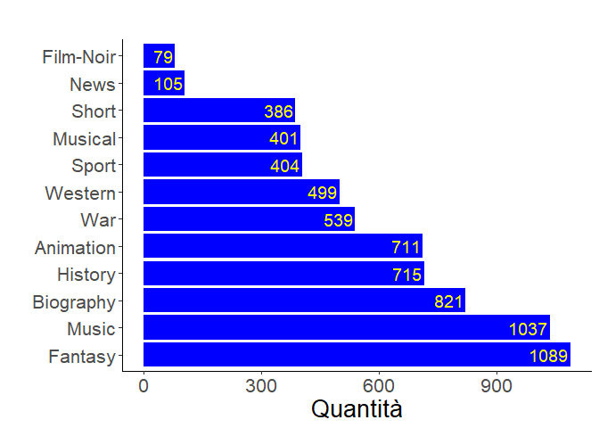
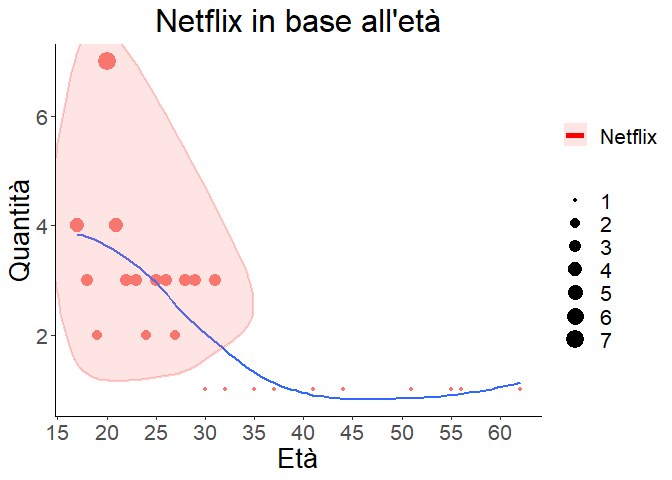

Esame fondamenti di scienza dei dati e laboratorio
================

## Obiettivo

L’avvento di internet e la sua diffusione in tutto il mondo ha
trasformato completamente il cinema. Se, solo pochi anni fa, per
guardare un film si doveva andare al cinema o acquistare i DvD, adesso
sono disponibili dei servizi che attraverso un pagamento mensile offrono
all’utente centinaia e migliaia di contenuti. L’obiettivo di questa
relazione è quello di capire se ha davvero senso averli tutti oppure se
ce ne sono alcuni migliori di altri. Andremo ad analizzare quale (se
esiste) sia il migliore servizio di streaming e in seguito vedremo
quello più utilizzato attraverso un sondaggio. Infine, tutta questa
concorrenza causa problemi ai consumatori?

## Dataset

In questa progetto andremo ad utilizzare 2 dataset che contengono
l’elenco di tutti i film e serie tv presenti su 4 piattaforme. La fonte
dei dati è: <https://bit.ly/3oBdvqG> che contiene gli script in python e
in javascript utilizzati per lo scraping dei dati. Dato che la maggior
parte delle piattaforme ha recentemente bloccato l’utilizzo di questi
script chiudendo gli account di chi li utilizza i dati si fermano a fine
2020. Verranno analizzate tutte le serie tv e i film presenti su:
Netflix, PrimeVideo, Disney+ e Hulu. 

``` r
# Lettura Dataset
film <- read.csv("films.csv")
serie <- read.csv("tv_shows.csv")
```

## Normalizzazione Database

Prima di iniziare ad analizzare i dataset andremo ad eliminare tutti i
dati non necessari per il nostro scopo così da diminuire i tempi di
compilazione ed evitare eventuali problemi in seguito:

Le ulteriori operazioni da eseguire saranno: . **Titoli minuscoli**: Per
evitare problemi nei confronti tra servizi rendo tutti i tioli in
minoscolo. . **Unione dataset**: creazione unico dataset che comprende
sia film che serie tv. . **ridenominazione**: per aumentare la chiarezza
ed eliminare gli spazi per problemi di compattibilità con SQL. Esempio:
“prime video” diventa “prime\_video”.

``` r
names(film) <- tolower(names(film)) #titoli in minuscolo
names(serie) <- tolower(names(serie))
data <- bind_rows(film, serie)  #unione dataset
data <- data[,c(3,4,6:17)] #cancello colonne che non verranno usate
colnames(data)[7] <- "prime_video"
colnames(data)[8] <- "disney+"
data$type[data$type == 0] <- "film" #se il tipo è 0 è un film. se 1 una serie
data$type[data$type == 1] <- "serie"
```

Infine, il dataset completo sarà composto da 22355 righe

## Quale servizio ha più contenuti?

Iniziamo ora la ricerca del miglior servizio di streaming. La prima cosa
che un utente normale cerca è una grande quantità di contenuti diversi
in modo tale da avere libertà di scelta e sempre qualcosa di nuovo da
guardare. Nel grafico seguente possiamo vedere sull’asse orrizzontale i
4 servizi analizzati e in quella verticale il numero di contenuti
corrispondenti.

``` r
N_SerieServizio <- data[,5:9] %>% group_by(type) %>% summarize_all(sum)
N_SerieServizio <-  melt(as.data.table(N_SerieServizio), id.vars="type")
colnames(N_SerieServizio) <- c("tipo", "piattaforma", "quantita")
N_SerieServizio$piattaforma <- gsub("_"," ",N_SerieServizio$piattaforma)
ggplot(N_SerieServizio, aes(fill=tipo, x = reorder(piattaforma, - quantita), y = quantita)) + 
  geom_bar(position="dodge", stat="identity") +
  scale_fill_manual(values = c("#0000ff", "#E50914")) +
  theme_classic() +
  ggtitle("Numero di film/serie per servizio") +
  xlab("Servizio") +
  ylab("Numero") +
  geom_text(aes(label=quantita), position=position_dodge(width=0.9), vjust=-0.25, size=5) +
  theme(text = element_text(size=20), plot.title = element_text(hjust = 0.5),
        legend.title = element_blank())
```

<!-- --> La prima cosa
che si nota è che in tutte e 4 le piattaforme c’è una differenza
sostanziale tra il numero di film rappresentato in blu e quello delle
serie tv in rosso. questo è principalmente dovuto al fatto che una serie
tv è composta da svariati episodi o da più stagioni. Quindi una serie
che ha 8 stagioni da 20 episodi ciascuna viene contata come 1. Invece i
film suddivisi in vari capitoli come harry potter vengono contati 1 ad
uno, in totale 8. L’eccezione la troviao in Hulu che si specializza
proprio sulle serie tv americane lasciando i fim in secondo piano.

Il secondo fatto da analizzare è l’assoluta superiorità di PrimeVideo e
al contempo l’inferiorità di disney+. Questi 2 servizi, anche se hanno
entrambi lo stesso obiettivo sono completamente differenti. 1. **Prime
Video**: è un servizio offerto da una delle società più ricche al mondo.
Amazon infatti dispone di un capitale talmente alto che gli permette di
acquistare i diritti di migliaia di film e serie senza troppi problemi.
Di recente ha anche iniziato a produrre. 1. **Disney+**: si tratta di
una piattaforma che contiene solo ed esclusivamente film/serie prodotte
o coprodotte da Disney.

\#\#Disponibilità Una domanda che sorge spontanea dopo aver visto il
grafico precedente è: Se compro l’abbonamento ad PrimeVideo che ha
migliaia di serie tv e film in più rispetto agli altri posso vedere
tutto? Tutti i film che ha Amazon li ha anche Netflix?

Per rispondere a questa domanda è sufficiente eseguire un confronto:

``` r
data$disponibilita <- rowSums(data[,5:8])
table(data$disponibilita)
```

    ## 
    ##     1     2     3 
    ## 21362   951    42

Questa tabella rappresente in numero di contenuti univoci per ogni
piattaforma. ci saranno:

1.  **21362**: contenuti disponibili SOLO in 1 servizio.
2.  **951**: contenuti disponibili in 2 servizi.
3.  **41**: contenuti disponibili in 3 servizi.
4.  **0**: contenuti disponibili in 4 servizi.

Quindi possiamo negare senza alcun dubbio l’ipotesi precedente. Infatti
21362 film/serie sono univoci e disponibili solo su uno dei 4 servizi.

\#\#Migliore disponibilità Appurato il fatto che non esiste un servizio
che comprende gli altri ci chiediamo quale sia il migliore da questo
punto di vista.

``` r
cat("Percentuale di titoli univoci:", "\n" ,
             "Netflix - ", percent(nrow(data[data$netflix == 1 & data$disponibilita == 1,])/nrow(data[data$netflix == 1,])), "\n",
             "Prime Video - ", percent(nrow(data[data$prime_video == 1 & data$disponibilita == 1,])/nrow(data[data$prime_video == 1,])),"\n",
             "HULU - ", percent(nrow(data[data$hulu == 1 & data$disponibilita == 1,])/nrow(data[data$hulu == 1,])),"\n",
             "Disney+ - ", percent(nrow(data[data$`disney+` == 1 & data$disponibilita == 1,])/nrow(data[data$`disney+` == 1,])))
```

    ## Percentuale di titoli univoci: 
    ##  Netflix -  90% 
    ##  Prime Video -  94% 
    ##  HULU -  79% 
    ##  Disney+ -  92%

Ne risulta che non c’è un migliore dato che le percentuali sono simili,
ma bensì un peggiore. Hulu contiene solo il 79% di titoli univoci.
Quindi il 21% dei titoli di Hulu sono disponibili anche su altre
piattaforme.

\#\#Film disponibili in base all’anno Un’altro fattore importante da
considerare è quanto siano aggiornate le piattaforme. Qualcuno potrebbe
pensare che un determinato servizio metta a disposizione solo contenuti
datati oppure solamente quelli nuovi. E’ importante quindi avere sia i
classici film prodotti prima del 2000 ma altrettanto necessario avere
quelli nuovi. Nel seguente grafico vediamo la quantità di media (serie
tv e film insieme) disponibili per ogni anno:

``` r
nuovi_contenuti <- sqldf("SELECT 
              year,
              case 
                  when netflix = 1 then 'netflix'
                  when hulu = 1 then 'hulu'
                  when prime_video = 1 then 'prime_video'
                  else 'disney+'
              end as piattaforma,
              count(1) as quantita
              
      FROM 
              data
     
      GROUP BY
              year,
              case 
                  when netflix = 1 then 'netflix'
                  when hulu = 1 then 'hulu'
                  when prime_video = 1 then 'prime_video'
                  else 'disney+'
              end")
ggplot(nuovi_contenuti, aes(fill=piattaforma, x = year, y = quantita)) + 
  geom_bar(position="dodge", stat="identity") +
  scale_fill_manual(values = c("#fbbe4f", "#99cc33", "#E50914", "#00A8E1")) +
  theme_classic() +
  #geom_line(color="red")+
  ggtitle("Nuovi film/serie per anno") +
  xlab("Anno") +
  ylab("Quantità") +
  theme(text = element_text(size=20), plot.title = element_text(hjust = 0.5),
        legend.title = element_blank())
```

<!-- --> Da questo
grafico si può osservare come prime video possida sia i media più
“datati” che queli più recenti rispetto a tutti gli altri servizi.
Questo fatto era prevedibile dallo studio precedente sulle quantità non
legato al tempo. Vediamo però le situazioni al dettaglio effettuando
degli ingrandimenti prima e dopo l’anno 2000 in cui è iniziata la
crescita esponenziale del cinema.

\#\#Situazione Dal 2000 a oggi

``` r
nuovi_contenuti <- sqldf("SELECT 
              year,
              case 
                  when netflix = 1 then 'netflix'
                  when hulu = 1 then 'hulu'
                  when prime_video = 1 then 'prime_video'
                  else 'disney+'
              end as piattaforma,
              count(1) as quantita
      FROM 
              data
      WHERE
              year > 2000  
              
     
      GROUP BY
              year,
              case 
                  when netflix = 1 then 'netflix'
                  when hulu = 1 then 'hulu'
                  when prime_video = 1 then 'prime_video'
                  else 'disney+'
              end")
ggplot(nuovi_contenuti, aes(fill=piattaforma, x = year, y = quantita)) + 
  geom_bar(position="dodge", stat="identity") +
  scale_fill_manual(values = c("#fbbe4f", "#99cc33", "#E50914", "#00A8E1")) +
  theme_classic() +
  ggtitle("Nuovi film/serie per anno") +
  xlab("Anno") +
  ylab("Quantità") +
  theme(text = element_text(size=20), plot.title = element_text(hjust = 0.5),
        legend.title = element_blank())
```

<!-- --> Oltre al
fatto che disney+ rimane costante, gli altri hanno subito un notevole
aumento per poi diminuire dopo il 2019. Questo rapido calo che riporta
il 2019/2020/2021 ai livelli degli anni 2000 è quasi sicurmante dovuto
alla pandemia da Covid-19 che, iniziata il 1° dicembre 2019 ha portato
alla chiusura/sospensione di quasi tutti i set cinematografici. Vediamo
anche come Netflix abbia superato PrimeVideo per la prima volta nella
quantità di contenuti proprio dopo il 2018

\#\#Situazione prima del 2000

``` r
nuovi_contenuti <- sqldf("SELECT 
              year,
              case 
                  when netflix = 1 then 'netflix'
                  when hulu = 1 then 'hulu'
                  when prime_video = 1 then 'prime_video'
                  else 'disney+'
              end as piattaforma,
              count(1) as quantita
      FROM 
              data
      WHERE
              year < 2000  
              
     
      GROUP BY
              year,
              case 
                  when netflix = 1 then 'netflix'
                  when hulu = 1 then 'hulu'
                  when prime_video = 1 then 'prime_video'
                  else 'disney+'
              end")
ggplot(nuovi_contenuti, aes(fill=piattaforma, x = year, y = quantita)) + 
  geom_bar(position="dodge", stat="identity") +
  #geom_line()+
  scale_fill_manual(values = c("#fbbe4f", "#99cc33", "#E50914", "#00A8E1")) +
  theme_classic() +
  ggtitle("Nuovi film/serie per anno") +
  xlab("Anno") +
  ylab("Quantità") +
  theme(text = element_text(size=20), plot.title = element_text(hjust = 0.5),
        legend.title = element_blank())
```

<!-- --> Anche qui
notiamo subilo la superiorità di PrimeVideo che, fa cominciare il suo
catalogo dal 1902 con il film: Viaggio nella Luna (A Trip to the Moon).
Anche se non sembra da questo grafico, ma il secondo in classifica è
disney+ che, con tutti i classici film di animazione raggiunge una buona
quantità. Per vederlo meglio eliminiamo PrimeVideo dal grafico:

``` r
nuovi_contenuti <- sqldf("SELECT 
              year,
              case 
                  when netflix = 1 then 'netflix'
                  when hulu = 1 then 'hulu'
                  else 'disney+'
              end as piattaforma,
              count(1) as quantita
      FROM 
              data
      WHERE
              year < 2000  
              
     
      GROUP BY
              year,
              case 
                  when netflix = 1 then 'netflix'
                  when hulu = 1 then 'hulu'
                  else 'disney+'
              end")
ggplot(nuovi_contenuti, aes(fill=piattaforma, x = year, y = quantita)) + 
  geom_bar(position="dodge", stat="identity") +
  #geom_line()+
  scale_fill_manual(values = c("#fbbe4f", "#99cc33", "#E50914", "#00A8E1")) +
  theme_classic() +
  ggtitle("Nuovi film/serie per anno") +
  xlab("Anno") +
  ylab("Quantità") +
  theme(text = element_text(size=20), plot.title = element_text(hjust = 0.5),
        legend.title = element_blank())
```

<!-- --> Infatti, nel
1921 Diney pubblica il suo primo film di animazione: I tre moschettieri.
Netflix e Hulu sono stabili e possiedono da 15 a 30 film/serie per ogni
anno.

\#\#Rapida evoluzione di Netflix In questo grafico animato vediamo
ancora una volta la situazione dopo gli anni 2000. Grazie all’animazione
è molto chiara la crescita di Netflix e PrimeVideo, la stabilità di
Disney e Hulu sempre una via di mezzo.

``` r
#install.packages('gifski')
#install.packages('png')
nuovi_contenuti <- sqldf("SELECT 
              year,
              case 
                  when netflix = 1 then 'netflix'
                  when hulu = 1 then 'hulu'
                  when prime_video = 1 then 'prime_video'
                  else 'disney+'
              end as piattaforma,
              count(1) as quantita
      FROM 
              data
      WHERE
              year >= 2000 AND year 
              
     
      GROUP BY
              year,
              case 
                  when netflix = 1 then 'netflix'
                  when hulu = 1 then 'hulu'
                  when prime_video = 1 then 'prime_video'
                  else 'disney+'
              end")

grafico <-ggplot(nuovi_contenuti, aes(fill=piattaforma, x = piattaforma, y = quantita)) + 
  geom_bar(position="dodge", stat="identity") +
  scale_fill_manual(values = c("#fbbe4f", "#99cc33", "#E50914", "#00A8E1")) +
  theme_classic() +
  ggtitle("Nuovi film/serie per anno") +
  xlab("") +
  ylab("Quantità") +
  theme(text = element_text(size=20), plot.title = element_text(hjust = 0.5),
        legend.title = element_blank())

animazione <- grafico + 
  transition_states(year,
                    transition_length = 0,
                    state_length = 1) + 
  ggtitle('{closest_state}')
  

animazione
```

<!-- -->

La prossima cosa da analizzare è la qualità che spesso è più importante
della qualità. Per farlo ci basiamo sulle recensioni (o meglio su un
voto da 1 a 10) che gli utenti danno ai film e le serie:

``` r
imdb_valutazioni <- sqldf("SELECT 
              type,
              case 
                  when netflix = 1 then 'netflix'
                  when hulu = 1 then 'hulu'
                  when prime_video = 1 then 'prime_video'
                  else 'disney+'
              end as piattaforma,
              round(avg(imdb), 1) as imdb_voti
      FROM 
              data
      GROUP BY
              type,
              case 
                  when netflix = 1 then 'netflix'
                  when hulu = 1 then 'hulu'
                  when prime_video = 1 then 'prime_video'
                  else 'disney+'
              end")

ggplot(imdb_valutazioni, aes(fill=type, x =  reorder(piattaforma, -imdb_voti), y = imdb_voti)) + 
  geom_bar(position="dodge", stat="identity") +
  scale_fill_manual(values = c("#fbbe4f", "#E50914")) +
  theme_classic() +
  ggtitle("IMDB media voti per piattaforma") +
  xlab("Piattaforma") +
  ylab("Voto") +
  coord_cartesian(ylim=c(2,8)) +
  geom_text(aes(label=imdb_voti), position=position_dodge(width=0.9), vjust=-0.25, size=5) +
  theme(text = element_text(size=20), plot.title = element_text(hjust = 0.5),
        legend.title = element_blank())
```

<!-- --> In questo
grafico abbiamo calcolato la media dei voti dati per ogni piattaforma
separando film e serie tv. Da qui si capisce subito che il mito che
sostiene che le serie tv siano di bassa qualità rispetto ai film è
falso. infatti in tutte le piattaforme i film hanno una valutazione
media più bassa. Confrontando tutte le piattaforme però non c’è una
grande differenza fra le valutazioni. quindi possiamo dire che la
qualità dei contenuti è simile.

\#\#Quantità dei generi Abbiamo visto che la qualità generale è circa la
stessa. Ma ci saranno dei generi in cui la qualità è migliore? Per prima
cosa, vediamo quali sono questi generi:

``` r
generi <- unique(unlist(strsplit(as.character(data$genres), ",")))
generi <- generi[!generi %in% NA] #cancello tutti i film che non hanno genere

# creo un datafrema dove andranno tutti i generi e la valutazione media per ognuno
valutazione_genere <- data.frame(genere=character(),
                           valutazione_media=double(), 
                           valutazione_netflix=double(),
                           valutazione_hulu=double(), 
                           valutazione_prime=double(),
                           valutazione_disney=double(),
                           quantita_totale = integer(),
                           quantita_netflix = integer(),
                           quantita_hulu = integer(),
                           quantita_prime_video = integer(),
                           quantita_disney = integer(),
                           stringsAsFactors=FALSE) 

for(i in 1:length(generi)) {
  
  genere <- generi[i]
  
  temp <- data[data$genres %like% genere,]
  
  valutazione_genere[i,1] <- genere
  valutazione_genere[i,2] <- round(mean(temp$imdb, na.rm = T), 1)
  valutazione_genere[i,3] <- round(mean(temp$imdb[temp$netflix == 1], na.rm = T), 1)
  valutazione_genere[i,4] <- round(mean(temp$imdb[temp$hulu == 1], na.rm = T), 1)
  valutazione_genere[i,5] <- round(mean(temp$imdb[temp$prime_video == 1], na.rm = T), 1)
  valutazione_genere[i,6] <- round(mean(temp$imdb[temp$`disney+` == 1], na.rm = T), 1)
  valutazione_genere[i,7] <- nrow(temp)
  valutazione_genere[i,8] <- nrow(temp[temp$netflix == 1, ])
  valutazione_genere[i,9] <- nrow(temp[temp$hulu == 1, ])
  valutazione_genere[i,10] <- nrow(temp[temp$prime_video == 1, ])
  valutazione_genere[i,11] <- nrow(temp[temp$`disney+` == 1, ])
}

#cancello i generi con meno di 105 contenuti
valutazione_genere_bassi <- valutazione_genere[c(27, 22, 23, 21, 19, 6, 12, 7,16,9,11,14), ]
valutazione_genere <- valutazione_genere[-c(26, 25, 24, 27, 22, 23, 21, 19, 6, 12, 7,16,9,11,14), ]

ggplot(valutazione_genere_bassi, aes(x =  reorder(genere, -quantita_totale), y = quantita_totale)) + 
  geom_bar(position="dodge", stat="identity") +
  geom_bar(stat="identity", fill="#0000FF") +
  theme_classic() +
  labs(title="") +
  xlab("") +
  ylab("Quantità") +
  geom_text(aes(label=quantita_totale), colour = "yellow", position=position_dodge(width=1), hjust=+1.07, size=5) +
  theme(text = element_text(size=20), plot.title = element_text(hjust = 0.5),
        legend.title = element_blank()) +
  coord_flip()
```

<!-- -->

``` r
ggplot(valutazione_genere, aes(x =  reorder(genere, -quantita_totale), y = quantita_totale)) + 
  geom_bar(position="dodge", stat="identity") +
  geom_bar(stat="identity", fill="#0000FF") +
  theme_classic() +
  labs(title="") +
  xlab("") +
  ylab("Quantità") +
 geom_text(aes(label=quantita_totale), colour = "yellow", position=position_dodge(width=1), hjust=+1.07, size=5) +
  theme(text = element_text(size=20), plot.title = element_text(hjust = 0.5),
        legend.title = element_blank()) +
  coord_flip() 
```

<!-- --> In questi 2
grafici vediamo l’elenco di tutti i generi cinematografici disponibili
sulle 4 piattaforme e la quantità totale di elementi. Drama,
comedy,thriller e action sono quelli più presenti. Ma la cosa che ci
interessa oltre alla quantità è la media dei voti per ciascuna
categoria:

\#\#Qualità delle catgorie Calcoliamo ora la media dei voti per ogni
categoria:

``` r
 g2<- ggplot(valutazione_genere, aes(x =  reorder(genere, -quantita_totale), y = valutazione_media)) + 
  geom_bar(position="dodge", stat="identity") +
  geom_bar(stat="identity", fill="#FFA500") +
  theme_classic() +
  labs(title="") +
  xlab("") +
  ylab("") +
  ylim(0, 8) +
  geom_text(aes(label=valutazione_media), position=position_dodge(width=1), vjust=0.25,hjust=-0.25) +
  theme(text = element_text(size=20), plot.title = element_text(hjust = 0.5)) +
  coord_flip()

g1 <- ggplot(valutazione_genere_bassi, aes(x =  reorder(genere, -quantita_totale), y = valutazione_media)) + 
  geom_bar(position="dodge", stat="identity") +
  geom_bar(stat="identity", fill="#FFA500") +
  theme_classic() +
  labs(title="IMDB voti") +
  xlab("") +
  ylab("") +
  ylim(0, 8) +
  geom_text(aes(label=valutazione_media), position=position_dodge(width=1), vjust=0.25,hjust=-0.25) +
  theme(text = element_text(size=20), plot.title = element_text(hjust = 0.5)) +
  coord_flip()

grid.arrange(g1, g2, ncol=2)
```

<!-- --> Se
escludiamo News che ha solo 100 contenuti, la categoira con i voti più
alti è documentary. Horror, sci-Fi e fantasy invece sono in fondo alla
classifica.

\#\#PARTE 2 Per la seconda parte di questo progetto ho sottoposto un
sondaggio a 187 persone cercando di diversificare il più possibile sulle
caratteristiche delle persone. Infatti, se al sondaggio avessero
risposto solamente esperti della tecnologia non avremo avuto una visione
equa della situazione.

``` r
sondaggio <- read.csv("Risultati_sondaggio.csv")
names(sondaggio)[4] <- "Disney+"
```

\#Quali servizi vengono usati? Dopo aver analizzato alcune differenze
dei servizi di streaming ci chiediamo quali vengano realmente utilizzati
tutti i giorni.

``` r
somma_servizi <- sondaggio[,2:12] %>% summarize_all(sum)


inverso <- data.frame(colnames(sondaggio[,2:12]), t(somma_servizi)[1:11])
names(inverso)[1] <- "Servizio"
names(inverso)[2] <- "Numero"

ggplot(inverso, aes(x =  reorder(Servizio, -Numero), y = Numero)) + 
  geom_bar(position="dodge", stat="identity") +
  geom_bar(stat="identity", fill="#FFA500") +
  theme_classic() +
  labs(title="Risultati sondaggio") +
  xlab("") +
  ylab("") +
  geom_text(aes(label=Numero), position=position_dodge(width=1), vjust=0.25,hjust=-0.25) +
  theme(text = element_text(size=20), plot.title = element_text(hjust = 0.5)) +
  coord_flip()
```

<!-- --> Questo
grafico mostra la quantità di persone che utilizzano un certo servizio.
Va sottolineato “utilizzano” perchè, come nel caso di TimVision o
PrimeVideo , molti lo possiedono perchè incluso in altre offerte ma non
lo vorrebbero/utilizzano. Il primo risultato schiacciate è quello di
Netflix. Infatti ben 55 persone, quasi 1 su 3. A seguire PrimeVideo,
Disney+ ecc. Interessante anche che Hulu, che abbiamo analizzato prima
sia quasi ultimo. questo è dovuto al fatto che non è disponibile in
italia. è accessibile solo tramite una vpn o vevendo all’estero. Delle 5
persone che lo utilizzano 4 vivono in America.

\#\#Ipotesi sul target di servizio per una età specifica Come ultima
problema di questo progetto, ci andremo a chiedere se l’utilizzo di un
certo servizio rispetto ad un’altro dipenda dall’età. La prima domanda
del seondaggio era proprio la richiesta dell’età:

``` r
eta<- sqldf("SELECT 
              eta,
              count(1) as Risposte
      FROM 
              sondaggio
    
      GROUP BY
              eta")
ggplot(eta, aes( x = eta, y = Risposte, colour="Red")) + 
  geom_line( colour="black")+
  #geom_point(Color="black") +
  geom_smooth()+
  theme_classic() +
  ggtitle("Età di chi ha risposto al sondaggio") +
  xlab("Età") +
  scale_x_continuous(breaks = seq(15, 75, by = 5))+
  ylab("Quantità") +
  theme(text = element_text(size=20), plot.title = element_text(hjust = 0.5),
        legend.title = element_blank())
```

    ## `geom_smooth()` using method = 'loess' and formula 'y ~ x'

<!-- --> Come già
detto prima, ho cercato di coprire più categorie possibili. Lastessa
cosa vale per l’età. In questo grafico vediamo L’età di chi ha risposto
rapportate alla quantità. Anche se tra i 15 e i 30 anni abbiamo molti
più dati, vediamo che la linea di tendenza è comunque abbastanza
stabile.

\#\#Servizi in base all’età

``` r
names(sondaggio)[4] <- "Disney"

eta_servizi <- sqldf("SELECT 
              eta,
              case 
                  when Netflix = 1 then 'Netflix'
                  when Hulu = 1 then 'Hulu'
                  when PrimeVideo = 1 then 'PrimeVideo'
                  When Disney = 1 then 'Disney'
                  When TimVision = 1 then 'TimVision'
                  When NowTV = 1 then 'NowTV'
                  When Infinity = 1 then 'Infinity'
                  When Dplay = 1 then 'Dplay'
                  When Chili = 1 then 'Chili'
                    When AppleTV = 1 then 'AppleTV'
                    When Crunchyroll = 1 then 'Crunchyroll'
                    else 'Nessuno'
              end as Piattaforma,
              count(1) as Quantita
              
      FROM 
              sondaggio
     
      GROUP BY
              eta,
              case 
                  when Netflix = 1 then 'Netflix'
                  when Hulu = 1 then 'Hulu'
                  when PrimeVideo = 1 then 'PrimeVideo'
                   When Disney = 1 then 'Disney'
                   When TimVision = 1 then 'TimVision'
                  When NowTV = 1 then 'NowTV'
                  When Infinity = 1 then 'Infinity'
                  When Dplay = 1 then 'Dplay'
                  When Chili = 1 then 'Chili'
                    When AppleTV = 1 then 'AppleTV'
                    When Crunchyroll = 1 then 'Crunchyroll'
                    else 'Nessuno'
              end")


eta_servizi<-eta_servizi[!(eta_servizi$Piattaforma=="Nessuno"),]


ggplot(eta_servizi, aes(fill=Piattaforma, x = eta, y = Quantita)) + 
  #geom_bar(position="dodge", stat="identity") +
  geom_point(aes(col=Piattaforma, size=Quantita)) +
  theme_classic() +
  scale_x_continuous(breaks = seq(15, 75, by = 5))+
  ggtitle("Servizi usati in base all'età") +
  xlab("Età") +
  ylab("Quantità") +
  theme(text = element_text(size=20), plot.title = element_text(hjust = 0.5),
        legend.title = element_blank())
```

<!-- --> Come
possiamo vedere da questo grafico, abbiamo 10 servizi di streaming
diversi. Tra i 15 e i 30 anni, ne troviamo un utilizzo maggiore. Ma se
guardiamo bene i colori, in questa fascia d’età troviamo il viola
(Netflix) e il rosa (PrimeVideo) che prevalgono su tutti gli altri.
Questo fatto era già stato analizzato in precedenza. Per osservare
meglio la situazione andiamo ad osservere un servizio alla volta:

``` r
library(gganimate)
#install.packages('gifski')
#install.packages('png')

g <- ggplot(eta_servizi, aes(fill=Piattaforma, x = eta, y = Quantita)) + 
  geom_point(aes(col=Piattaforma, size=3)) +
  theme_classic() +
  
  scale_x_continuous(breaks = seq(15, 75, by = 5))+
  #ggtitle("Netflix in base all'età") +
  xlab("Età") +
 
  ylab("Quantità") +
  theme(text = element_text(size=20), plot.title = element_text(hjust = 0.5),
        legend.title = element_blank())

anim <- g + 
  transition_states(Piattaforma,
                    transition_length = 0,
                    state_length = 1) + 
  ggtitle('{closest_state}')
  

anim
```

<!-- --> In questo
modo riusciamo a trovare moltissime differenze: 1. **AppleTv**: Poco
diffuso, qualche utilizzo nella fascia 20-25 e 40-45 1. **Chili**: Poco
diffuso, utilizzato solo tra i 40-50 anni 1. **Crunchyroll**: Buona
diffusione solamente tra i 15 e 25 anni. Questo servizio infatti
fornisce in streaming prevalentemente cartoni animati 1. **Disney+**:
Alta diffusione in tutte le età, ma non più di 2 persone intervistate
della stessa età lo utilizzano 1. **Dplay**: Bassa diffusione.
Utilizzato soamente da 50-55 anni. 1. **Hulu**: Bassa diffusione. Solo
tra 20-30 anni 1. **Infinity**: Bassa diffusione. Da 20-30 e 40-45 1.
**Netflix**: Altissima diffusione in tutte le età. In particolare tra
15-30 1. **NowTv**: bassa diffusione tra 20-40 anni 1. **PrimeVideo+**:
Altissima diffusione in tutte le età. In particolare da 25 a 40

Analizziamo in dettaglio i 2 servizi più diffusi:

``` r
eta_servizi_netflix<-eta_servizi[(eta_servizi$Piattaforma=="Netflix"),]
eta_servizi_netflix2<-eta_servizi_netflix[(eta_servizi_netflix$Quantita>1 ),]
gg1 <- ggplot(eta_servizi_netflix, aes(fill=Piattaforma, x = eta, y = Quantita)) + 
  #geom_bar(position="dodge", stat="identity") +
  geom_point(aes(col=Piattaforma, size=Quantita)) +
  theme_classic() +
  geom_smooth(method="loess", se=F) +
  geom_encircle(aes(x=eta, y=Quantita), 
              data=eta_servizi_netflix2, 
              color="red", 
               size=2, 
              alpha=0.2,
               expand=0.1) +
  scale_x_continuous(breaks = seq(15, 75, by = 5))+
  ggtitle("Netflix in base all'età") +
  xlab("Età") +
  ylab("Quantità") +
  theme(text = element_text(size=20), plot.title = element_text(hjust = 0.5),
        legend.title = element_blank())
```

``` r
eta_servizi_Prime<-eta_servizi[(eta_servizi$Piattaforma=="PrimeVideo"),]
eta_servizi_Prime2<-eta_servizi_Prime[(eta_servizi_Prime$Quantita>1 ),]
gg2 <- ggplot(eta_servizi_Prime, aes(fill=Piattaforma, x = eta, y = Quantita)) + 
  #geom_bar(position="dodge", stat="identity") +
  geom_point(aes(col=Piattaforma, size=Quantita)) +
  theme_classic() +
  geom_smooth(method="loess", se=F) +
  geom_encircle(aes(x=eta, y=Quantita),
              data=eta_servizi_Prime2,
              color="red", 
               size=2, 
              alpha=0.2,
               expand=0.1) +
  scale_x_continuous(breaks = seq(15, 75, by = 5))+
  ggtitle("PrimeVideo in base all'età") +
  xlab("Età") +
  ylab("Quantità") +
  theme(text = element_text(size=20), plot.title = element_text(hjust = 0.5),
        legend.title = element_blank())


gg1
```

    ## `geom_smooth()` using formula 'y ~ x'

<!-- -->

``` r
gg2
```

    ## `geom_smooth()` using formula 'y ~ x'

<!-- --> Vediamo che
ci sono 2 aree in particolare che cerchieremo di rosso in cui l’utilizzo
è molto più elevato. Notiamo anche che, c’è una piccola differenza tra i
2 grafici.

``` r
gg1 <- ggplot(eta_servizi_netflix, aes(fill=Piattaforma, x = eta, y = Quantita)) + 
  #geom_bar(position="dodge", stat="identity") +
  #geom_point(aes(col=Piattaforma, size=Quantita)) +
  theme_classic() +
  geom_smooth(method="loess", se=F) +
 
  scale_x_continuous(breaks = seq(15, 75, by = 5))+
  ggtitle("Netflix in base all'età") +
  xlab("Età") +
  ylab("Quantità") +
  theme(text = element_text(size=20), plot.title = element_text(hjust = 0.5),
        legend.title = element_blank())

gg2 <- ggplot(eta_servizi_Prime, aes(fill=Piattaforma, x = eta, y = Quantita)) + 
  #geom_bar(position="dodge", stat="identity") +
  #geom_point(aes(col=Piattaforma, size=Quantita)) +
  theme_classic() +
  geom_smooth(method="loess", se=F) +
  scale_x_continuous(breaks = seq(15, 75, by = 5))+
  scale_y_continuous(breaks = seq(0, 3, by = 1))+
  ggtitle("PrimeVideo in base all'età") +
  xlab("Età") +
  ylab("Quantità") +
  theme(text = element_text(size=20), plot.title = element_text(hjust = 0.5),
        legend.title = element_blank())


grid.arrange(gg1, gg2, ncol=1)
```

    ## `geom_smooth()` using formula 'y ~ x'
    ## `geom_smooth()` using formula 'y ~ x'

<!-- --> Isolando
tutti i dati e tenendo solo la riga di tendenza vediamo come siano in
realtà diversi Netflix raggiunge il picco tra i 15 e 20 anni. Invece
PrimeVideo lo raggiunge a 30. Differente anche il tipo di curva. Sul
grafico di Netflix abbiamo una partenza alta e una discesa costante,
Invece su PrimeVideo inizia costante per poi salire e riscendere.

\#\#Conclusione In conclusione non esiste un servizio di streaming
migliore di altri, ma sono tutti diversi. Differiscono in base al target
di età e ai tipi di contenuti.
